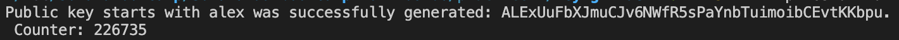
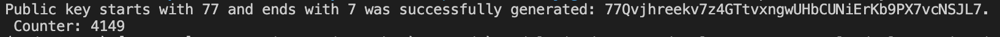

# Generate a vanity address (case insensitive)

Vanity publickeys, or custom addresses are keys that have start with specific characters. For example, a person may want a publickey to start with "elv1s", or maybe even "cook". These can help other people remember who the key belongs to, making the key more easily identifiable - [Source](https://solanacookbook.com/references/keypairs-and-wallets.html#how-to-generate-a-vanity-address)

### Create a .env file with environment variables:
```ts
STARTS_WITH = "alex"
ENDS_WITH = ""
```
If you want the pattern to match at the end, specify ```ENDS_WITH```, otherwise leave the env empty

### Run program with:
```bash
npm i
npx esrun vanity-address.ts
```

## Examples

#### 1. Key starts with "alex"
```ts
STARTS_WITH = "alex"
ENDS_WITH = ""
```



#### 2. Key starts with 77 and ends with 7
```ts
STARTS_WITH = "77"
ENDS_WITH = "7"
```


